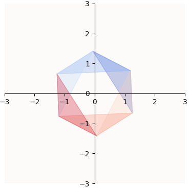

# Latent Space Visualizer for 1-layer ReLU MLP

ReLU MLPs typically have this component:

$$
y = \text{ReLU}(Wx + b) \text{, where } W \in \mathbb{R}^{d \times h}, d > h
$$

For example, in Transformers, the MLP block implements this equation:

$$
y = W_\text{dec} \left( \text{ReLU} (W_\text{enc}x + b_\text{enc})\right) + b_\text{dec}
$$

And in Autoencoders, we have:

$$
y = \text{ReLU}(W_\text{dec}W_\text{enc} + b_\text{dec})
$$

The important part is that $\text{ReLU}$ comes after multiplying by a tall matrix (up-projection), and is able to hydrate more dimensions of information that the bottleneck dimension, especially if the data is sparse. How does this happen? Each $(W_i, b_i)$ pair determines how the rank-$h$ subspace is tilted in $\mathbb{R}^d$ space relative to dimension $i$ and shifted w.r.t to the origin, and $\text{ReLU}$ effectively segments the rank-$h$ subspace into 2 disjoint half-spaces at coordinate plane hyperplane defined by $x_i = 0$. One half-space corresponds to the negative (nullified) region of $\text{ReLU}$, while the other half-space corresponds to the positive (retained) region of $\text{ReLU}$. This illustration shows one such half-space pair corresponding to dimension $z$ (note that we only visualize a polygon in that rank-$h=2$ subspace for reasons that will be explained below):

    

So, if $W \in \mathbb{R}^{6 \times h}$ and $b \in \mathbb{R}^6$, the way to visualize what the MLP does to the rank-$h$ subspace spanned by $W$, is to think of that subspace as a superposition of 6 pairs of disjoint half-spaces.

    

**This library is about visualizing latent spaces as the superposition of half-space pairs.** To introduce readers to this library, we will talk about the case where $W \in \mathbb{R}^{d \times 2}$, because visualizing a 2-dimensional bottleneck hidden space is easy. 

## Visualization Setup

In the case of $W \in \mathbb{R}^{d \times 2}$, we know that our latent space is a $2$-dimensional subspace that lives in a $d$-dimensional universe, spanned by the columns of $W$. We are interested in visualizing a segment of this $2$-dimensional subspace and see how the superposition of half-space pairs looks like. So, we have to define the segment of space we want to visualize.

### Defining Where To Visualize

This library allows users to provide a set of `plane_points` which define the vertices that bound the segment of space to visualize. Why? This library was made for the mech interp context, where we are interested in extracting "features" of a deep model. In Anthropic's toy auto-encoder scenario, we had this:

$$
y = \text{ReLU}(W^\top Wx + b)
$$

which I'll rewrite in a more generalized manner:

$$
\begin{align*}
y & = \text{ReLU}(W_\text{dec} W_\text{enc} x + b) \text{, where } \\
W_\text{dec} & \in \mathbb{R}^{d \times h}\\
W_\text{enc} & \in \mathbb{R}^{h \times d}
\end{align*}
$$

The goal of their toy auto-encoder was to be able to reconstruct input features in $x$. So:
- The entries of $x$ are "features", i.e. $x_1$ is "feature 1", $x_2$ is "feature 2", and so on.
- $W_\text{enc} x$ refers to the down-projected features
- $W_\text{enc} e_i$ or $W_\text{enc, i}$ refers to the "feature $i$ direction" in the bottleneck latent space
- $W_\text{dec} W_\text{enc} e_i$ or $W_\text{dec} W_\text{enc, i}$ refers to the "feature $i$ direction" in the reconstructed latent space, because it's simply an up-projection of $W_\text{enc, i}$ to the larger-dimensional reconstructed latent space.

So, the region of interest to visualize are demarcated by the feature directions in the reconstructed latent space, i.e. $\{W_\text{dec} W_\text{enc} e_i + b \mid \forall i \in [1, d] \} \in \mathbb{R}^d$. These are precisely the `plane_points`.

## Example Use and Details

